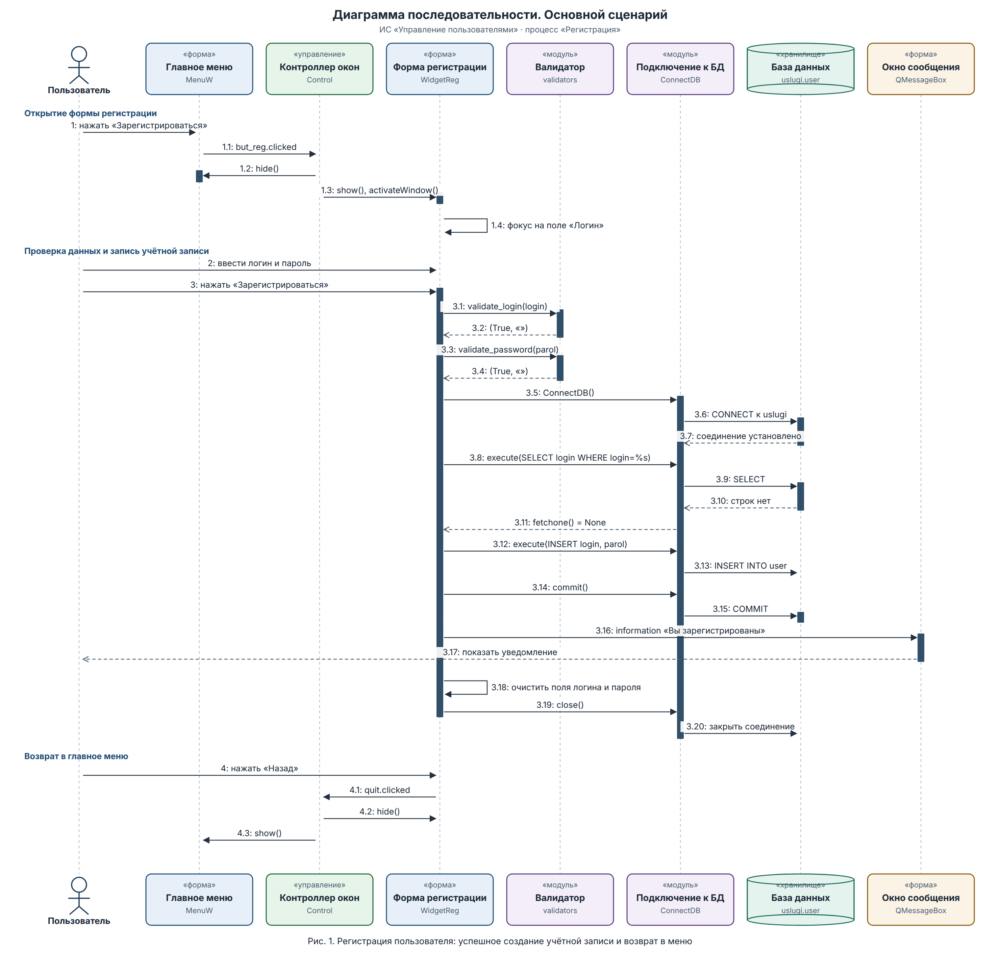
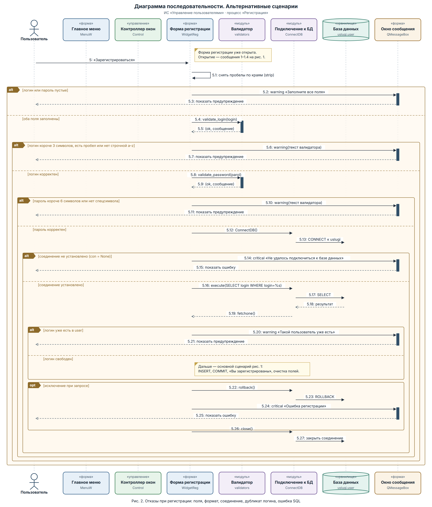
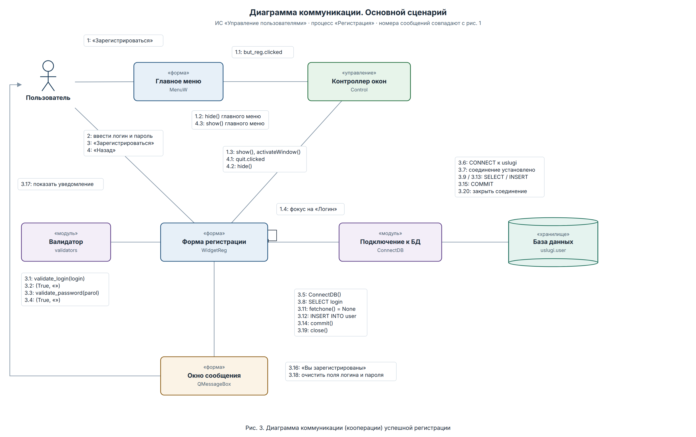
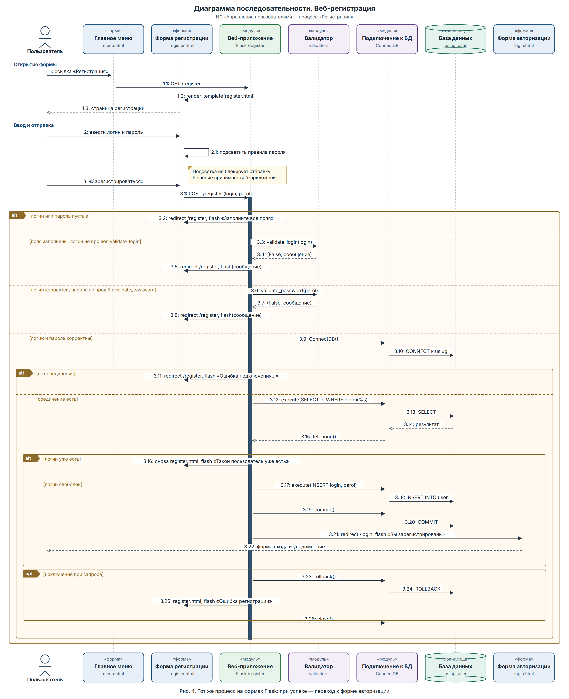

# Диаграммы взаимодействия. Процесс «Регистрация в системе»

Процесс создаёт учётную запись в ИС «Управление пользователями»: логин и пароль попадают в таблицу `user` базы `uslugi`. Объекты диаграмм — формы и остальные части системы, а не таблицы базы и не отдельные кнопки.

В системе два интерфейса одного и того же процесса:

- десктоп на PyQt6: формы `MenuW`, `WidgetReg`, контроллер окон `Control`;
- веб на Flask: формы `menu.html`, `register.html`, `login.html` и маршрут `/register`.

Номера сообщений на диаграмме коммуникации совпадают с диаграммой последовательности основного сценария.

## Объекты

| Объект | Часть ИС | Роль в регистрации |
| --- | --- | --- |
| Пользователь | актор | Открывает форму, вводит логин и пароль |
| Главное меню | форма `MenuW` / `menu.html` | Точка входа, кнопка или ссылка «Регистрация» |
| Контроллер окон | `Control` | Прячет текущую форму и показывает нужную |
| Форма регистрации | форма `WidgetReg` / `register.html` | Принимает логин и пароль |
| Валидатор | модуль `validators` | Проверяет формат до обращения к базе |
| Подключение к БД | модуль `ConnectDB` | Открывает сеанс MySQL и выполняет запросы формы |
| База данных | хранилище `uslugi.user` | Хранит учётные записи (`login`, `parol`) |
| Окно сообщения | форма `QMessageBox` | Предупреждения и уведомление в десктопе |
| Веб-приложение | модуль Flask, маршрут `/register` | Принимает POST, пишет flash-сообщение |
| Форма авторизации | форма `login.html` | Экран, на который веб-приложение переходит после успешной регистрации |

Правила валидатора:

- логин — не короче 3 символов, без пробелов, хотя бы одна строчная латинская буква;
- пароль — не короче 6 символов и хотя бы один символ, который не является буквой или цифрой.

Пароль записывается в таблицу в том виде, в каком его ввели.

## Предусловия и результат

Предусловия: приложение запущено, на экране главное меню, сервер MySQL доступен для успешного завершения.

Успешный результат: в `user` есть новая строка, пользователь видит «Вы зарегистрированы», поля десктопной формы очищены, соединение с базой закрыто. В веб-интерфейсе после этого открывается форма авторизации.

## Основной сценарий (десктоп)

1. Пользователь нажимает «Зарегистрироваться» в главном меню. Контроллер прячет меню и показывает форму регистрации. Фокус встаёт на поле «Логин».
2. Пользователь вводит логин и пароль и нажимает «Зарегистрироваться».
3. Форма вызывает валидатор. Оба вызова возвращают `(True, "")`.
4. Форма создаёт `ConnectDB`. Модуль подключается к базе `uslugi`.
5. Форма ищет логин (`SELECT`). Строки нет.
6. Форма вставляет строку (`INSERT`), фиксирует транзакцию (`COMMIT`) и показывает «Вы зарегистрированы».
7. Форма очищает поля и закрывает соединение.
8. По кнопке «Назад» контроллер прячет форму регистрации и снова показывает главное меню.

## Альтернативные сценарии (десктоп)

Форма уже открыта. Дальше развилка зависит от данных и от базы.

- Пустой логин или пароль — предупреждение «Заполните все поля». До валидатора и базы управление не доходит.
- Логин не проходит проверку — предупреждение с текстом валидатора.
- Пароль не проходит проверку — такое же предупреждение.
- Соединение не открылось (`con` пустой) — критическое сообщение «Не удалось подключиться к базе данных».
- Логин уже есть в `user` — предупреждение «Такой пользователь уже есть».
- Логин свободен — дальше сообщения 3.12–3.18 основного сценария: `INSERT`, `COMMIT`, уведомление, очистка полей.
- Исключение при запросе — `ROLLBACK` и критическое сообщение «Ошибка регистрации». Этот фрагмент необязательный (`opt`).
- Если соединение было открыто, форма закрывает его и в случае отказа, и после записи.

## Диаграмма коммуникации

Та же успешная регистрация, те же объекты. Линия показывает, кто с кем связан; номер около линии — сообщение с рис. 1.

Сообщение 3.17 («показать уведомление») идёт от окна сообщения к пользователю по контуру слева: прямая линия пересекла бы валидатор.

## Веб-регистрация

Пользователь открывает `menu.html` и переходит по ссылке «Регистрация». Веб-приложение отдаёт `register.html`. Пока пароль вводится, форма только подсвечивает правила длины и спецсимвола. Подсветка отправку не блокирует: решение принимает маршрут `/register`.

Дальше те же проверки, что в десктопе, но ответ другой:

- ошибка полей, формата или соединения — `redirect` обратно на `/register` и flash-сообщение;
- логин занят — снова `register.html` и flash «Такой пользователь уже есть» (без redirect);
- логин свободен — `INSERT`, `COMMIT`, redirect на форму авторизации и flash «Вы зарегистрированы»;
- исключение — `ROLLBACK`, flash «Ошибка регистрации», страница регистрации остаётся;
- `close()` вызывается только если соединение было открыто.

Исходные рисунки в SVG лежат рядом с PNG. Пересборка: `python3 docs/trp/build_diagrams.py`.
