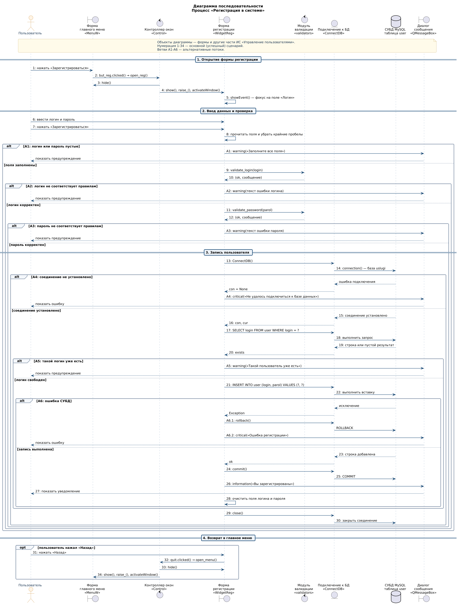
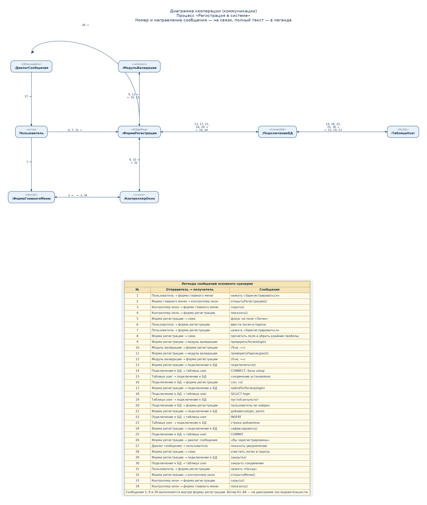

# Диаграммы взаимодействия. Процесс «Регистрация в системе»

Диаграммы построены по реализации ИС «Управление пользователями» (десктоп, PyQt6):
форма главного меню, форма регистрации, контроллер окон, модуль валидации,
подключение к MySQL и диалог сообщения.

В UML диаграммы взаимодействия — это диаграмма последовательности и диаграмма
кооперации (в UML 2 её также называют диаграммой коммуникации). Нумерация
сообщений на обеих диаграммах совпадает.

| Файл | Диаграмма |
| --- | --- |
| [01-posledovatelnost.puml](01-posledovatelnost.puml) | последовательность, основной сценарий и ветви A1–A6 |
| [01-posledovatelnost.png](01-posledovatelnost.png) | то же, рисунок |
| [02-kooperaciya.dot](02-kooperaciya.dot) | кооперация, основной сценарий и легенда |
| [02-kooperaciya.png](02-kooperaciya.png) | то же, рисунок |

Пересобрать рисунки из каталога `docs/trpo/registraciya`:

```bash
java -jar plantuml.jar -charset UTF-8 -tpng 01-posledovatelnost.puml
java -jar plantuml.jar -charset UTF-8 -tsvg 01-posledovatelnost.puml
neato -n2 -Tpng -o 02-kooperaciya.png 02-kooperaciya.dot
neato -n2 -Tsvg -o 02-kooperaciya.svg 02-kooperaciya.dot
```

## Объекты

Объектами выбраны формы и другие части ИС, а не таблицы базы как единственные
участники. Пользователь — внешний актор.

| Объект | Стереотип UML | Часть ИС | Назначение в процессе |
| --- | --- | --- | --- |
| `:ФормаГлавногоМеню` | boundary, класс `MenuW` | форма | Кнопка «Зарегистрироваться», возврат в меню |
| `:КонтроллерОкон` | control, класс `Control` | управляющая часть | `open_reg()`, `open_menu()`, скрытие остальных окон |
| `:ФормаРегистрации` | boundary, класс `WidgetReg` | форма | Поля «Логин» и «Пароль», кнопки «Зарегистрироваться» и «Назад» |
| `:МодульВалидации` | control, модуль `validators` | правила ввода | `validate_login`, `validate_password` |
| `:ПодключениеБД` | entity, класс `ConnectDB` | доступ к данным | Соединение, курсор, `commit`, `rollback`, `close` |
| `:ТаблицаUser` | database | СУБД MySQL, БД `uslugi`, таблица `user` | Хранение `login` и `parol` |
| `:ДиалогСообщения` | boundary, `QMessageBox` | форма обратной связи | Предупреждение, ошибка или уведомление об успехе |

Правила, которые применяет модуль валидации:

- логин — не короче 3 символов, без пробелов, есть строчная латинская буква;
- пароль — не короче 6 символов и содержит хотя бы один специальный символ.

## Диаграмма последовательности



Чтение сверху вниз. Сплошная стрелка — вызов, пунктир — возврат результата.
Рамки `alt` — взаимоисключающие ветви, рамка `opt` — необязательное продолжение.

### Основной сценарий

1. Пользователь нажимает «Зарегистрироваться» на форме главного меню.
2. Форма передаёт сигнал контроллеру окон (`open_reg`).
3. Контроллер скрывает главное меню.
4. Контроллер показывает форму регистрации и переводит на неё фокус.
5. Форма регистрации в `showEvent` ставит курсор в поле «Логин».
6. Пользователь вводит логин и пароль.
7. Пользователь нажимает «Зарегистрироваться».
8. Форма читает поля и убирает пробелы по краям.
9. Форма запрашивает у модуля валидации проверку логина.
10. Модуль возвращает `(True, "")`.
11. Форма запрашивает проверку пароля.
12. Модуль возвращает `(True, "")`.
13. Форма создаёт объект подключения к БД.
14. Подключение открывает базу `uslugi`.
15. СУБД подтверждает соединение.
16. Форма получает соединение и курсор.
17. Форма ищет логин: `SELECT login FROM user WHERE login = ?`.
18. Подключение выполняет запрос.
19. СУБД возвращает пустой результат.
20. Форма получает признак «пользователь не найден».
21. Форма добавляет запись: `INSERT INTO user (login, parol) VALUES (?, ?)`.
22. Подключение выполняет вставку.
23. СУБД подтверждает вставку.
24. Форма фиксирует транзакцию (`commit`).
25. СУБД выполняет `COMMIT`.
26. Форма открывает диалог «Вы зарегистрированы».
27. Диалог показывает уведомление пользователю.
28. Форма очищает поля логина и пароля.
29. Форма закрывает подключение.
30. Подключение закрывает соединение с СУБД.
31. Пользователь нажимает «Назад» (необязательно, сразу после успеха не требуется).
32. Форма сообщает контроллеру о возврате (`open_menu`).
33. Контроллер скрывает форму регистрации.
34. Контроллер снова показывает форму главного меню.

Шаги 31–34 находятся в рамке `opt`: пользователь может остаться на форме
регистрации и ввести следующего пользователя.

### Альтернативные потоки

| Ветвь | Условие | Что происходит | Куда возвращается управление |
| --- | --- | --- | --- |
| A1 | Логин или пароль пустые после обрезки | Диалог: «Заполните все поля» | Форма регистрации, данные не пишутся |
| A2 | Логин короче 3 символов, содержит пробел или не содержит `a-z` | Диалог с текстом `validate_login` | Форма регистрации |
| A3 | Пароль короче 6 символов или без спецсимвола | Диалог с текстом `validate_password` | Форма регистрации |
| A4 | `ConnectDB` не получил соединение | Диалог: «Не удалось подключиться к базе данных». `close()` не вызывается | Форма регистрации |
| A5 | Строка с таким `login` уже есть | Диалог: «Такой пользователь уже есть», затем `close()` | Форма регистрации |
| A6 | Исключение при `SELECT` или `INSERT` | `rollback()`, диалог «Ошибка регистрации», затем `close()` | Форма регистрации |

До успешной записи форма не вызывает `commit`. При A5 изменения отсутствуют,
при A6 транзакция откатывается.

## Диаграмма кооперации



Та же совокупность объектов и та же нумерация, что на диаграмме
последовательности. На связи стоят номера сообщений и направление:
стрелка к получателю, подпись `→` для вызова и `←` для ответа.
Сообщение 26 проведено дугой сверху — от формы регистрации к диалогу,
чтобы не пересекать модуль валидации. Текст каждого номера — в легенде
под рисунком.

Сообщения 5, 8 и 28 форма регистрации выполняет сама (фокус, чтение полей,
очистка), отдельной связи с другим объектом у них нет. Альтернативы A1–A6
на эту диаграмму не вынесены: их развилки показаны на диаграмме
последовательности.

## Соответствие веб-интерфейсу

Веб-версия выполняет тот же процесс. Меняются только граничные объекты:

| Объект десктопа | Объект веб-версии |
| --- | --- |
| Форма главного меню `MenuW` | страница `menu.html`, маршрут `/` |
| Контроллер окон `Control` | маршруты Flask: переход `/` → `/register` и ссылка «Назад» |
| Форма регистрации `WidgetReg` | форма `register.html` (поля `login`, `parol`) |
| Диалог `QMessageBox` | flash-сообщение на странице |
| Модуль валидации, `ConnectDB`, таблица `user` | те же части ИС |

После успешной регистрации веб-форма дополнительно переходит на страницу
авторизации. Проверки логина, пароля, уникальности и запись в `user` совпадают
с сообщениями 9–30.
